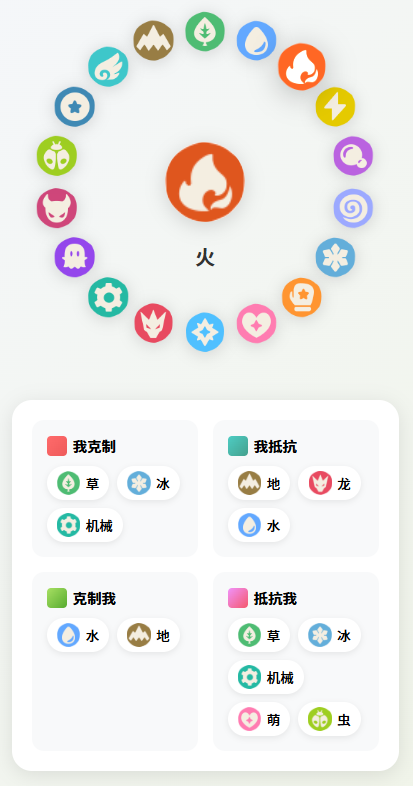

# 洛克王国属性克制关系图

一个展示洛克王国属性克制关系的交互式网页应用。

## 📸 效果预览



*点击属性图标查看详细的克制关系*

> 💡 **提示**: 如果图片无法显示，请在浏览器中打开 `index.html` 查看实际效果。

## ✨ 功能特点

- 🎯 **18 种属性圆形布局展示** - 所有属性按圆形排列，直观美观
- 🔄 **交互式点击体验** - 点击任意属性图标查看详情
- 📊 **四大克制关系分类** - 清晰展示克制关系:
  - 🔴 **我克制** - 克制对方的属性
  - 🔵 **我抵抗** - 抵抗对方的攻击
  - 🟢 **克制我** - 克制我的属性
  - 🟠 **抵抗我** - 抵抗我的攻击
- ⚔️ **天敌关系特别标记** - 红色高亮显示天敌属性
- 🎨 **动态颜色匹配** - 属性名称颜色自动匹配图标颜色
- 📱 **响应式设计** - 完美适配手机、平板、电脑等各种屏幕

## 🎮 操作说明

1. **点击属性图标** - 点击圆环上的任意属性图标
2. **查看中心属性** - 中央圆形会显示选中的属性图标和名称
3. **浏览克制关系** - 下方信息面板展示详细的克制关系
4. **识别天敌** - 带有红色标记的是天敌关系 (我打他抵抗，他打我克制)

## 📋 属性列表

| 序号 | 属性 | 序号 | 属性 | 序号 | 属性 |
|------|------|------|------|------|------|
| 1 | 草 | 7 | 冰 | 13 | 幽灵 |
| 2 | 水 | 8 | 武 | 14 | 恶魔 |
| 3 | 火 | 9 | 萌 | 15 | 虫 |
| 4 | 电 | 10 | 光 | 16 | 普通 |
| 5 | 毒 | 11 | 龙 | 17 | 翼 |
| 6 | 幻 | 12 | 机械 | 18 | 地 |

## 🚀 使用方法

### 方法一：直接打开
直接双击 `index.html` 文件在浏览器中打开即可使用。

### 方法二：使用本地服务器

#### 使用 Python
```bash
python -m http.server 8000
```

#### 使用 Node.js
```bash
npx http-server -p 8000
```

然后在浏览器中访问 `http://localhost:8000`

## 🛠️ 技术栈

- **HTML5** - 语义化结构
- **CSS3** - 现代样式和动画效果
- **JavaScript (原生)** - 无需任何框架，轻量高效
- **Canvas API** - 图标颜色提取

## 📱 兼容性

- ✅ Chrome / Edge (推荐)
- ✅ Firefox
- ✅ Safari
- ✅ 移动端浏览器

## 📦 项目结构

```
洛克王国属性克制/
├── index.html          # 主页面
├── image/              # 属性图标目录
│   ├── icon-type-1.png
│   ├── icon-type-2.png
│   └── ...
├── README.md           # 项目说明
└── .gitignore          # Git 忽略文件
```

## 🎨 颜色说明

- **我克制**: 红色系 (#ff6b6b)
- **我抵抗**: 青色系 (#4ecdc4)
- **克制我**: 绿色系 (#56ab2f)
- **抵抗我**: 粉色系 (#f5576c)

## 📄 License

MIT License

---

**享受游戏！祝你在洛克王国中战无不胜！** 🎉
